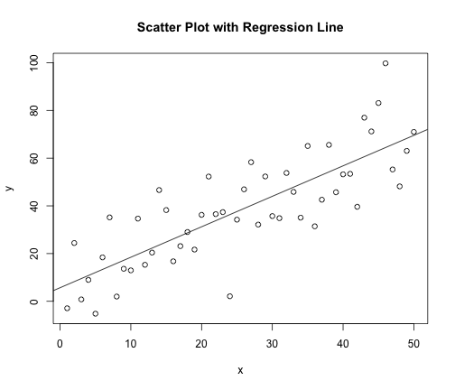

plot test
========================================================

First make something to plot (simulate regression data).


```r
n <- 50
x <- seq(1, n)
a.true <- 3
b.true <- 1.5
y.true <- a.true + b.true * x
s.true <- 17.3
y <- y.true + s.true * rnorm(n)
out1 <- lm(y ~ x)
```


Figure 1. is produced by the following code


```r
plot(x, y, main = "Scatter Plot with Regression Line")
abline(out1)
```

 

